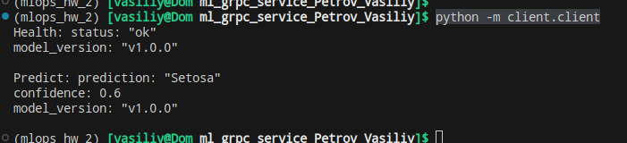
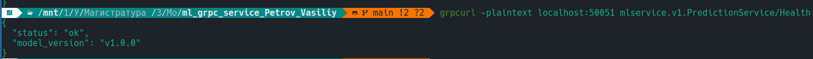
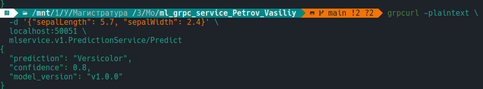

## ДЗ №2 Реализация /health и /predict эндпоинтов в gRPC-сервисе

### Описание

В качестве модели будет использоваться классификатор ирисов Фишера из прошлого семестра:
Модель на вход получает sepal_length: float, sepal_width: float и отдает метку класса

- models/model.pkl - сама модель
- models/scaler.pkl - для преобразования данных
- models/class_names.pkl - для получения имен классов


### Сборк и запуск

(Опционально) создать новое окружение (например через conda):

`conda create -n mlops_hw python=3.12`
`conda activate mlops_hw`

Установить зависимости:
`pip install -r requirements.txt`

Собрать Docker-образ:

`docker build -t grpc-ml-service .`

Запустить контейнер:

`docker run -p 50051:50051 grpc-ml-service`

Сервер будет доступен на `localhost:50051`


### Проверка

1) Можно запустить `python -m client.client` который проверит с захардкоженными значениями.
Клиент использует таймауты (2 сек для /health, 5 сек для /predict):



2) Через grpcurl:

- /health

`grpcurl -plaintext localhost:50051 mlservice.v1.PredictionService/Health`



- /predict

```
grpcurl -plaintext \
  -d '{"sepalLength": 5.7, "sepalWidth": 2.4}' \
  localhost:50051 \
  mlservice.v1.PredictionService/Predict
```


